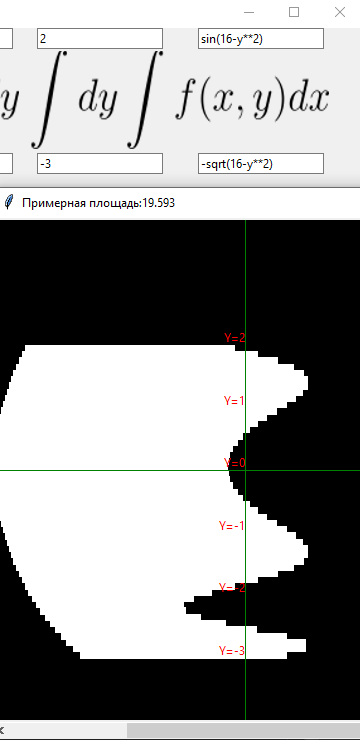
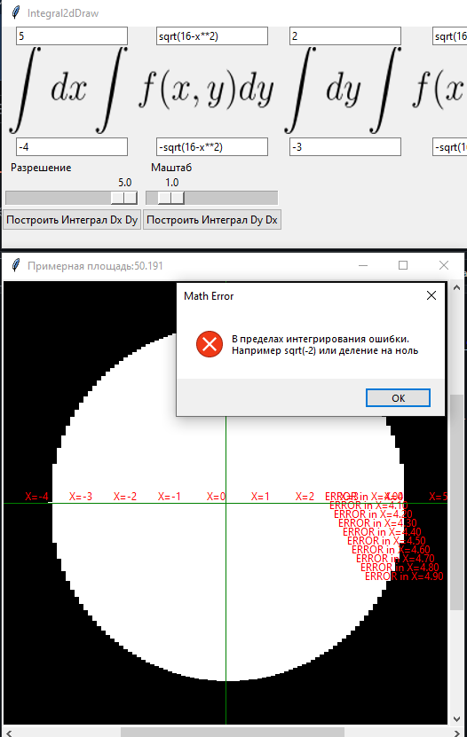
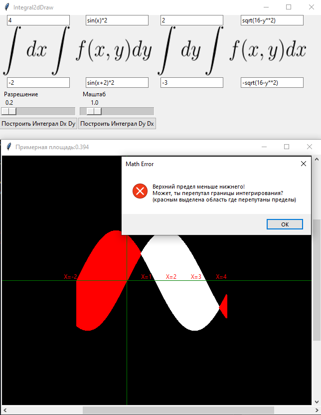

# Integral2dDraw
## Preview
Это приложение рисует фигуру интеграла по его пределам

В пределах вы можете написать любое математическое выражение в формате Python ,[клик сюда для примера!](https://codechick.io/tutorials/python/numbers-and-math-functions)<br />
(библиотеки *__[math](https://docs.python.org/3/library/math.html)__* и *__numpy__* подключены)
```python
from math import *
import numpy as np
```




Приложение умеет показывать ошибки:<br />



## Установка
Нужен [python](https://www.python.org/downloads/)
```bash
python --version
Python 3.11.4
```

Нужно установить пакеты [pip](https://pip.pypa.io/en/stable/) для запуска Integral2dDraw


```bash
pip install numpy
pip install Pillow
```
